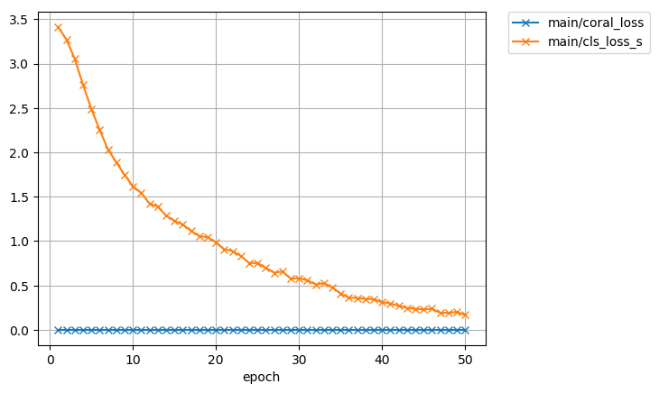
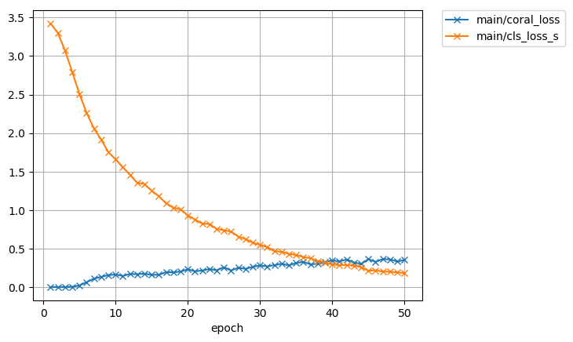
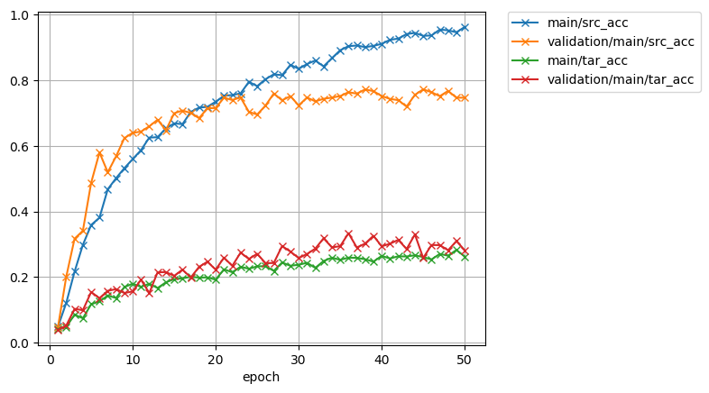

# DeepCORAL-Chainer
Chainer implementation of DeepCORAL domain adaptation.

'Deep CORAL: Correlation Alignment for Deep Domain Adaptation. B Sun, K Saenko, ECCV 2016'

> Deep CORAL can learn a nonlinear transformation that aligns correlations of
layer activations in deep neural networks (Deep CORAL).

[中文介紹](https://ssarcandy.tw/2017/10/31/deep-coral/)

## Convert pretrain Alexnet coffemodel
alexnet.npz file was converted from [bvlc_alexnet.caffemodel](http://dl.caffe.berkeleyvision.org/bvlc_alexnet.caffemodel) using converter.py script. 

## Implementation results

- Training loss without CORAL

- Training loss with CORAL

- Training accuracy without CORAL

- Training accuracy with CORAL

## Requirement

- Python 3
- PyTorch 0.3

## Usage

1. Unzip dataset in `dataset/office31.tar.gz`
2. Run `python main.py`

